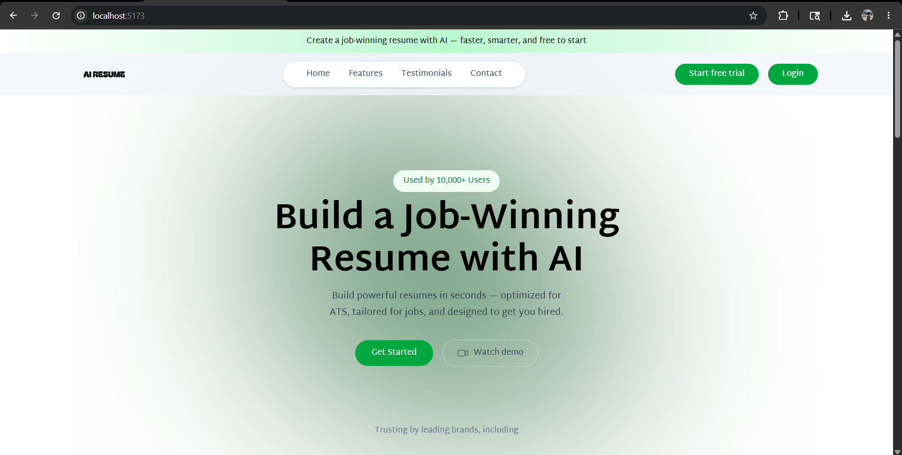
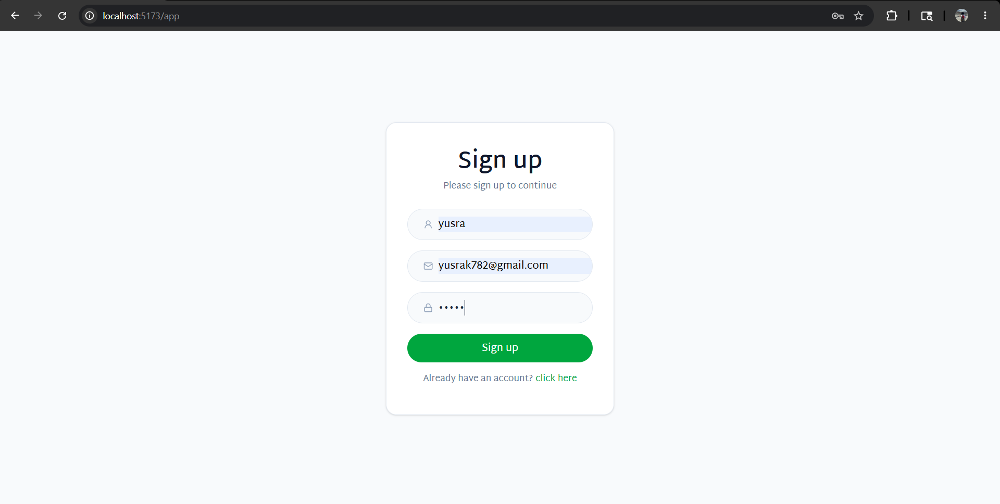
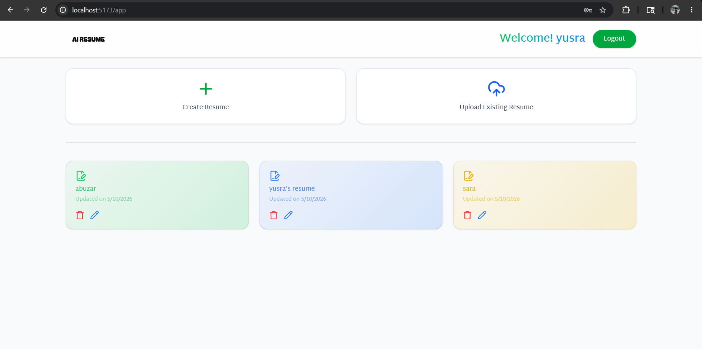
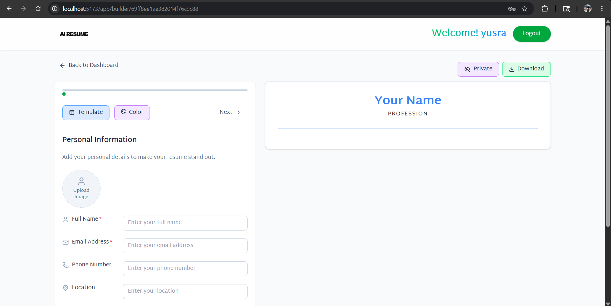
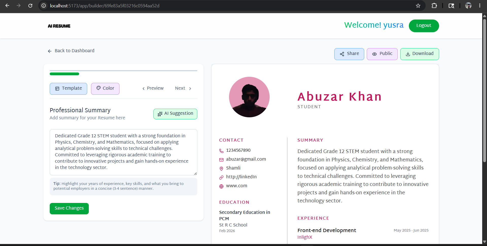
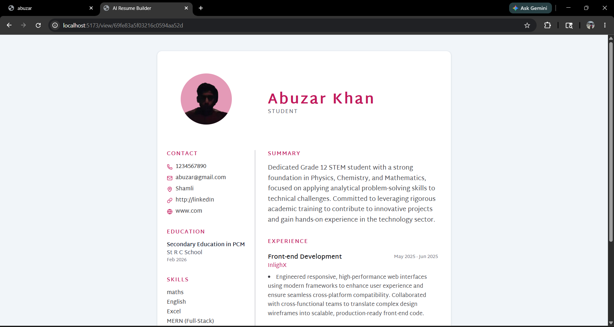
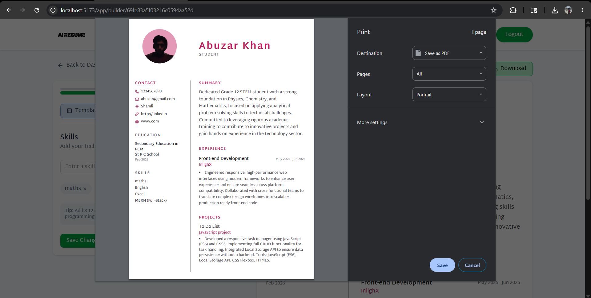

# AI Resume Builder

[](https://opensource.org/licenses/MIT)
[](https://reactjs.org/)
[](https://nodejs.org/)
[](https://www.mongodb.com/)

An AI-powered resume builder that helps users create professional resumes with real-time preview, AI-enhanced summaries, public sharing, and PDF export functionality.

## 🚀 Features

- **AI-Enhanced Summaries**: Use OpenAI to generate professional resume summaries
- **Multiple Templates**: Choose from Classic, Minimal, Modern, and Minimal Image templates
- **Customizable Design**: Customize resume templates and colors
- **Comprehensive Sections**: Add experience, education, projects, skills, and more
- **Real-Time Preview**: See changes instantly as you build your resume
- **Public Sharing**: Share your resume with a public link
- **Secure Authentication**: JWT-based user authentication with password hashing
- **Image Upload**: Upload profile pictures using ImageKit integration
- **Responsive Design**: Works seamlessly on desktop and mobile devices

## 🛠 Tech Stack

### Frontend
- **React 19** - Modern JavaScript library for building user interfaces
- **Vite** - Fast build tool and development server
- **Redux Toolkit** - State management for complex applications
- **Tailwind CSS** - Utility-first CSS framework
- **React Router** - Declarative routing for React
- **Axios** - HTTP client for API requests
- **Lucide React** - Beautiful icon library
- **React Hot Toast** - Toast notifications

### Backend
- **Node.js** - JavaScript runtime
- **Express.js** - Web application framework
- **MongoDB** - NoSQL database
- **Mongoose** - MongoDB object modeling
- **OpenAI API** - AI-powered content generation
- **JWT** - JSON Web Tokens for authentication
- **bcrypt** - Password hashing
- **Multer** - File upload handling
- **ImageKit** - Image optimization and delivery
- **CORS** - Cross-origin resource sharing

## 📋 Prerequisites

- Node.js (v18 or higher)
- MongoDB (local or cloud instance)
- OpenAI API key
- ImageKit account (for image uploads)

## 🚀 Installation

1. **Clone the repository**
   ```bash
   git clone https://github.com/yusraKhan1312/ai-resume-builder.git
   cd ai-resume-builder
   ```

2. **Set up the backend**
   ```bash
   cd server
   npm install
   ```

3. **Set up the frontend**
   ```bash
   cd ../client
   npm install
   ```

4. **Environment Configuration**

   Create a `.env` file in the `server` directory with the following variables:
   ```env
   PORT=3000
   MONGODB_URI=mongodb://localhost:27017/resume-builder
   JWT_SECRET=your-super-secret-jwt-key
   AI_MODEL=gpt-3.5-turbo
   OPENAI_API_KEY=your-openai-api-key
   IMAGEKIT_PUBLIC_KEY=your-imagekit-public-key
   IMAGEKIT_PRIVATE_KEY=your-imagekit-private-key
   IMAGEKIT_URL_ENDPOINT=https://ik.imagekit.io/your-imagekit-id
   ```

5. **Start the development servers**

   **Backend:**
   ```bash
   cd server
   npm run server
   ```

   **Frontend:**
   ```bash
   cd client
   npm run dev
   ```

6. **Access the application**

   Open your browser and navigate to `http://localhost:5173` (Vite default port)

## 📖 Usage

1. **Register/Login**: Create an account or log in to your existing account
2. **Create Resume**: Start building a new resume from scratch
3. **Fill Sections**:
   - Personal Information
   - Professional Summary (use AI enhancement)
   - Work Experience
   - Education
   - Projects
   - Skills
4. **Customize**: Choose a template and color
5. **Preview**: Review your resume in real-time
6. **Download/Share**: Export as PDF or share publicly

## 🖼 Screenshots

### Home Page


### Sign Up


### Dashboard


### Resume Builder


### AI Resume Improvement


### Shareable Resume Link


### PDF Download


## 📡 Core Functionalities

- User authentication and authorization
- Resume CRUD operations
- AI-powered summary enhancement
- Public resume sharing
- PDF resume export

## 📄 License

This project is licensed under the MIT License - see the [LICENSE](LICENSE) file for details.

## 🙏 Acknowledgments

- OpenAI for providing powerful AI models
- ImageKit for image optimization services
- The open-source community for amazing tools and libraries

## 📞 Support

If you have any feedback or suggestions, feel free to open an issue on GitHub.

---

Built with React, Node.js, MongoDB, and OpenAI.</content>